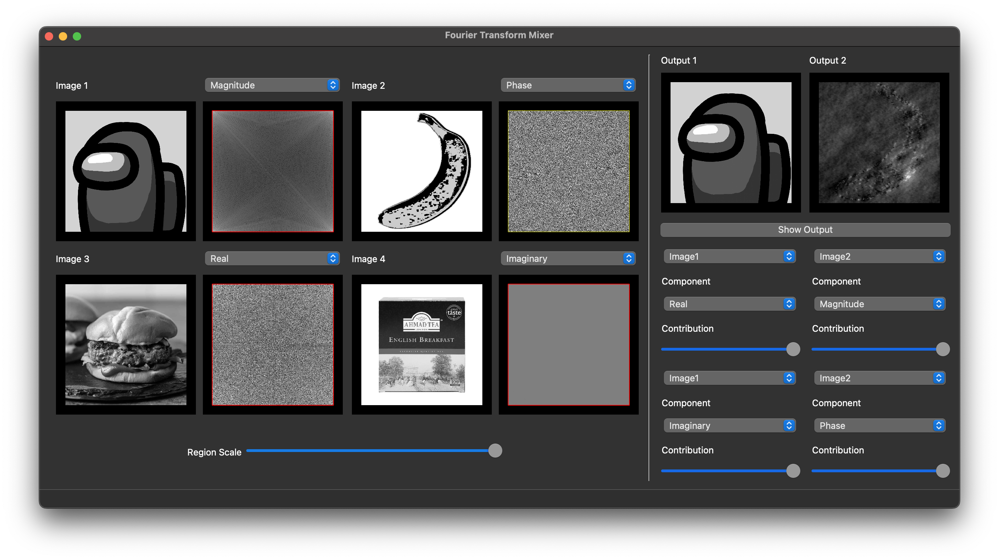

# Fourier Transform Mixer Studio

## Introduction

The **Fourier Transform Mixer Studio** is an innovative desktop application designed to illustrate the significance of magnitude and phase components while highlighting the frequency contributions in a signal. While this project primarily focuses on 2D signals, particularly images, the fundamental concept extends to various signal types. This software aims to provide an interactive platform for users to explore and manipulate the Fourier Transform components of grayscale images, mixing them in real-time to create customized outputs.

## Features

### Image Viewers:

- **Open and View:**

  - Users can open and view four grayscale images, with the program automatically converting colored images to grayscale.
  - The sizes of the opened images are unified to the smallest size among them.

- **Fourier Transform Components:**

  - Each image has two displays: one fixed display for the image and a dynamic display showing Fourier Transform components.
  - The Fourier Transform components include Magnitude, Phase, Real, and Imaginary components, selectable through a combo-box/drop-menu.

- **Easy Browsing:**
  - Users can change any of the images by double-clicking on its viewer, providing a convenient browsing function.

### Output Ports:

- **Two Output Viewports:**
  - Mixer results can be displayed in one of two output viewports, each mirroring the input image viewport.
  - Users can control which viewport displays the new mixer result.

### Brightness/Contrast Adjustment:

- **Image Enhancement:**
  - Users can dynamically adjust the brightness and contrast (window/level) of the image via mouse dragging.
  - This adjustment is applicable to each of the four Fourier Transform components.

### Components Mixer:

- **Weighted Average:**
  - The output image is the inverse Fourier Transform of a weighted average of the Fourier Transforms of the input four images.
  - Users can customize the weights of each image's Fourier Transform using intuitive sliders.

### Regions Mixer:

- **Frequency Regions:**
  - For each Fourier Transform component, users can choose the region to include in the output: inner region (low frequencies) or outer region (high frequencies).
  - A customizable rectangle drawn on each Fourier Transform allows users to select the region, with adjustable size via sliders.
  - The selected region is highlighted through semi-transparent coloring or hashing, ensuring uniformity across all four images.



- **Installation:**

  - Prerequisites:

    - Python 3.6 or higher installed
    - Git installed

  - Clone the repository:

    ```
    git clone <repo_url>
    ```

    This will create a local copy of the repository on your machine. Replace the `<repo_url>` with the url of this github repository

  - Navigate to the project directory:

    ```
    cd directory
    ```

    Change to the directory where the repository was cloned.

  - Install the required dependencies:

    ```
    pip install -r requirements.txt
    ```

    This will install all the necessary dependencies for the application.

  - Run the application:
    ```
    python main.py
    ```
    This will start the Signal Sampling Desktop App.
